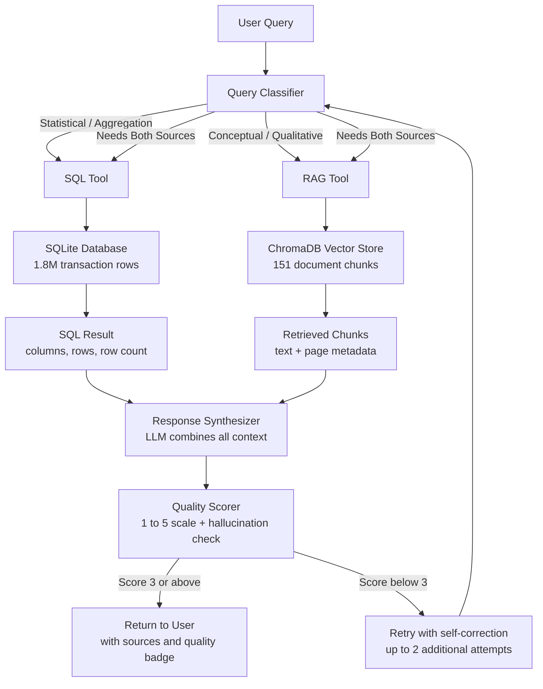
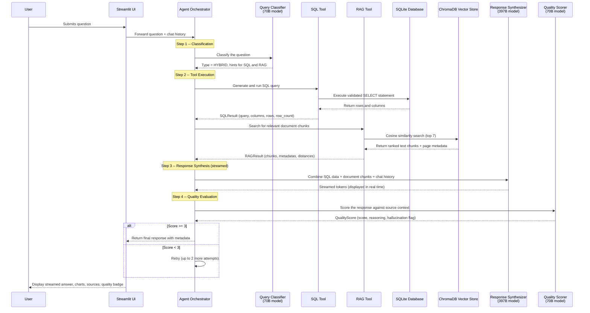

# Mekari Challenge Test - Fraud Analysis Agent

A Q&A chatbot that extracts meaningful information from two different data sources: a large tabular fraud transaction dataset (1.8M+ rows from Kaggle) stored in SQLite, and an unstructured PDF document ("Understanding Credit Card Frauds") indexed in a ChromaDB vector store. The system uses Together AI's LLM API for natural language understanding, SQL generation, and response synthesis, with a built-in quality scoring mechanism that detects hallucinations and triggers self-correction when needed.

Built with Python, Streamlit, SQLite, ChromaDB, and Together AI.

---

## Table of Contents

1. [Architecture Overview](#architecture-overview)
2. [How It Works -- Step by Step](#how-it-works----step-by-step)
3. [Data Processing Pipeline](#data-processing-pipeline)
4. [Text-to-SQL Approach](#text-to-sql-approach)
5. [RAG Pipeline](#rag-pipeline)
6. [Quality Scoring and Self-Correction](#quality-scoring-and-self-correction)
7. [Exception Handling Strategy](#exception-handling-strategy)
8. [Performance Considerations](#performance-considerations)
9. [Query-to-Answer Mapping](#query-to-answer-mapping)
10. [Project Structure and Code Organization](#project-structure-and-code-organization)
11. [Configuration](#configuration)
12. [Getting Started](#getting-started)
13. [Running Tests](#running-tests)
14. [Known Limitations](#known-limitations)

---

## Architecture Overview

The system follows an Agentic RAG pattern. Rather than treating every question the same way, an orchestrator agent first classifies the user's intent, then routes it to the appropriate tool (or both), synthesizes a grounded response, and finally self-evaluates the quality of that response before returning it.



**Why this design?** A single monolithic prompt cannot reliably handle both "give me monthly fraud statistics from 1.8M rows" and "explain the methods of credit card fraud according to this PDF." By splitting the work into specialized tools and letting a classifier decide which tool to invoke, each component can be optimized independently. The quality scorer then acts as a safety net, catching hallucinations or incomplete answers before they reach the user.

---

## How It Works -- Step by Step

The following sequence diagram shows what happens when a user submits a question through the Streamlit interface. This example illustrates a hybrid query that requires both data sources.



Each step is shown to the user in real time through a collapsible status panel in the Streamlit UI. The user sees messages like "Classifying your question...", "Generating and executing SQL query...", "Searching document for relevant information...", and "Evaluating response quality..." as the pipeline progresses. The final response is streamed token by token so the user does not have to wait for the entire answer to be generated before seeing output.

---

## Data Processing Pipeline

### Tabular Data: CSV to SQLite

The system ingests two CSV files from the Kaggle Fraud Dataset (fraudTrain.csv and fraudTest.csv) into a single SQLite table called `fraud_transactions`. The full pipeline:

1. **Read CSVs** using pandas, loading both train and test sets.
2. **Parse dates** by converting the `trans_date_trans_time` column to a proper datetime format.
3. **Concatenate** both dataframes into a single table (1,852,394 total rows, of which 9,651 are fraudulent).
4. **Write to SQLite** using `pandas.to_sql()` with chunked inserts for memory efficiency.
5. **Create indexes** on `is_fraud`, `category`, and `trans_date_trans_time` to speed up the most common query patterns (fraud filtering, category grouping, and time-range filtering).

The resulting database is approximately 700MB. The ingestion takes about 60 seconds on first run and is skipped on subsequent runs if the database file already exists.

### Document Data: PDF to ChromaDB

The PDF processing pipeline converts the "Understanding Credit Card Frauds" document into searchable vector embeddings:

1. **PDF Extraction**: PyPDF2 reads the PDF page by page, preserving the actual page number for each extracted text block.
2. **Text Chunking**: Each page's text is split into chunks of approximately 500 characters with 100-character overlap. The chunker respects sentence boundaries wherever possible, so chunks do not cut off mid-sentence. This produces 151 chunks from the 17-page document.
3. **Metadata Assignment**: Each chunk is tagged with its source filename, page number, and a unique chunk ID.
4. **Embedding Generation**: Each chunk is sent individually to Together AI's embedding endpoint (model: `BAAI/bge-base-en-v1.5`) to produce a 768-dimensional vector. Texts are truncated to 400 characters before embedding to stay within the model's 512-token limit.
5. **Vector Storage**: Chunks, embeddings, and metadata are stored in a ChromaDB persistent collection named `fraud_reports` using cosine similarity as the distance metric.

The embedding step sends one chunk per API call to avoid exceeding the model's per-request token limit. For 151 chunks, this takes about 40 seconds.

---

## Text-to-SQL Approach

Converting natural language questions into correct SQL is one of the harder parts of this system. The approach uses schema-aware few-shot prompting with a multi-step validation pipeline.

### How SQL is Generated

The LLM receives a system prompt containing:

- The full schema of the `fraud_transactions` table (all 21 columns with their SQLite types)
- Three worked examples mapping English questions to valid SQL queries
- Explicit rules: SELECT-only, use `strftime()` for date operations, include WHERE clauses, limit results unless aggregating

The model (70B, chosen for speed over the 397B) generates a SQL query based on the user's question and the conversation history.

### Validation Pipeline

Generated SQL goes through a five-step validation before execution:

| Step | What It Does | Why It Matters |
|------|-------------|----------------|
| 1. Generate | LLM produces SQL from natural language | Starting point |
| 2. Parse (EXPLAIN) | SQLite's EXPLAIN is used as a dry run to check syntax | Catches syntax errors without executing |
| 3. Safety Check | Regex scan for forbidden keywords: DROP, DELETE, INSERT, UPDATE, ALTER, PRAGMA | Prevents destructive operations |
| 4. Execute | Run the validated query against SQLite | Produces actual results |
| 5. Format | Convert column names and rows into structured data | Ready for the synthesizer |

If step 2 or 3 fails, the system regenerates the SQL (up to 3 attempts total). If execution returns an error, the error message is fed back to the LLM to correct the query.

### Why Not an ORM or Pre-Built Queries?

The challenge requires answering open-ended questions about the data. Pre-built queries would only cover known question patterns. By generating SQL dynamically, the system can handle questions the developer never anticipated, such as "What is the average transaction amount for grocery purchases on weekends?" or "Which state has the lowest fraud rate?"

---

## RAG Pipeline

RAG (Retrieval-Augmented Generation) is used to answer questions about concepts and information found in the PDF document. The pipeline:

1. **Query Embedding**: The user's question is embedded using the same model (`BAAI/bge-base-en-v1.5`) that was used to embed the document chunks.
2. **Cosine Similarity Search**: ChromaDB finds the 7 most similar chunks by cosine distance.
3. **Context Assembly**: The retrieved chunks are formatted with their page numbers and source information.
4. **Synthesis**: The LLM generates an answer grounded in the retrieved chunks, citing page numbers in the response.

The top-7 retrieval count was chosen as a balance between providing enough context for comprehensive answers and staying within the LLM's context window. Each chunk is roughly 500 characters, so 7 chunks total about 3,500 characters of context.

---

## Quality Scoring and Self-Correction

Every response generated by the system is evaluated before being shown to the user. This serves two purposes: it gives the user a confidence indicator, and it allows the system to catch and correct poor answers automatically.

### Scoring Rubric

A separate LLM call evaluates the response against the source context (SQL results and/or retrieved document chunks) on a 1-to-5 scale:

| Score | Meaning |
|-------|---------|
| 5 | Fully accurate, cites specific data or pages, answers all parts of the question |
| 4 | Accurate with minor omissions, good use of citations |
| 3 | Mostly accurate, answers the core question but may lack detail |
| 2 | Partially correct, missing key information or contains unsupported claims |
| 1 | Incorrect, contains hallucinated information, or fails to address the question |

### Hallucination Detection

The scorer specifically checks for:

- Statistical claims not directly derivable from the SQL result set
- Qualitative claims not found in the retrieved text chunks
- Numbers or percentages that do not match the source data

If hallucination is detected, the `has_hallucination` flag is set to true and the specific issue is described in the scoring reasoning.

### Self-Correction Loop

- If the score is 3 or above, the response is returned to the user immediately.
- If the score is below 3, the system retries the entire pipeline (classify, retrieve, synthesize) up to 2 additional times.
- After all retries, the best-scored response across all attempts is returned. If that score is still below 3, a disclaimer is appended warning the user that the response may have limited accuracy.

---

## Exception Handling Strategy

The system is designed to handle failures gracefully at every layer, rather than crashing or returning generic error messages.

### Input Validation

| Scenario | How It Is Handled |
|----------|-------------------|
| Empty query | Returns a prompt asking the user to enter a question |
| Excessively long query (>2000 chars) | Truncated to prevent token overflow |
| Potential prompt injection | Input is sanitized to remove system prompt override patterns |

### SQL Safety

| Scenario | How It Is Handled |
|----------|-------------------|
| Destructive SQL (DROP, DELETE, etc.) | Blocked by regex before execution; query is rejected |
| Syntax errors in generated SQL | Caught by EXPLAIN dry-run; query is regenerated (up to 3 times) |
| Runtime SQL errors | Error message is captured and fed back to the LLM for self-correction |
| Empty result set | User is informed that no matching records were found and invited to rephrase |
| Query returns too many rows | Results are automatically limited to prevent UI overload |

### API and Infrastructure Failures

| Scenario | How It Is Handled |
|----------|-------------------|
| Together AI timeout or 5xx error | Logged and surfaced as a user-friendly error message |
| Together AI rate limit (429) | Reported to user with suggestion to wait and retry |
| Invalid LLM response format (e.g., unparseable JSON) | Falls back to keyword-based classification instead of crashing |
| ChromaDB connection failure | System degrades to SQL-only mode with a disclaimer |
| SQLite connection failure | System degrades to RAG-only mode with a disclaimer |

### Graceful Degradation

For hybrid queries where both tools are invoked, if one tool fails, the system still produces an answer using the other tool. The response includes a note explaining that one data source was unavailable. If both tools fail, the system returns a clear status message rather than a broken or empty response.

---

## Performance Considerations

### Model Selection Strategy

The system uses different models for different tasks to balance quality and speed:

| Task | Model | Reasoning |
|------|-------|-----------|
| Query classification | 70B (routing model) | Simple classification task; smaller model responds faster |
| SQL generation | 70B (routing model) | Structured output; does not need the largest model |
| Response synthesis | 397B (primary model) | Most important output; largest model produces highest quality |
| Quality scoring | 70B (routing model) | Evaluation is a focused task; speed matters for user experience |
| Embeddings | bge-base-en-v1.5 | Purpose-built embedding model; not a chat model |

All model names are configurable through environment variables, so switching models requires no code changes.

### Streaming

Response synthesis uses streaming via the Together AI API. Tokens are sent to the Streamlit UI as they are generated, so the user sees output immediately rather than waiting for the full response. This significantly improves perceived latency, especially for longer answers.

### Database Indexing

The SQLite table has indexes on `is_fraud`, `category`, and `trans_date_trans_time`. These cover the most common query patterns (filtering fraudulent transactions, grouping by category, and filtering by date range) and reduce query execution time from seconds to milliseconds on the 1.8M row table.

### Connection Reuse

Both the SQLite connection and the Together AI client are initialized once and reused across requests within the same session, avoiding the overhead of reconnecting on every query.

### Conversation Context

The system maintains conversation history within a session. The last 3 exchanges (6 messages) are included in both the classifier and synthesizer prompts, allowing the model to understand follow-up questions like "break that down by month" or "what about the grocery category?" without the user needing to repeat context.

---

## Query-to-Answer Mapping

This section explains how each of the six sample questions is handled by the system, including which tool is invoked and what kind of SQL or search query is generated.

### Q1: "How does the daily or monthly fraud rate fluctuate over the two-year period?"

- **Classification**: SQL (statistical aggregation over time)
- **Tool**: SQL Tool
- **Expected SQL pattern**: `SELECT strftime('%Y-%m', trans_date_trans_time) AS month, ROUND(AVG(is_fraud) * 100, 2) AS fraud_rate FROM fraud_transactions GROUP BY month ORDER BY month`
- **Output**: Time-series data rendered as a line chart in the UI

### Q2: "Which merchants or merchant categories exhibit the highest incidence of fraudulent transactions?"

- **Classification**: SQL (categorical aggregation)
- **Tool**: SQL Tool
- **Expected SQL pattern**: `SELECT category, COUNT(*) AS fraud_count FROM fraud_transactions WHERE is_fraud = 1 GROUP BY category ORDER BY fraud_count DESC`
- **Output**: Ranked list with a bar chart visualization

### Q3: "What are the primary methods by which credit card fraud is committed?"

- **Classification**: RAG (qualitative, conceptual)
- **Tool**: RAG Tool
- **Search query**: "primary methods credit card fraud committed"
- **Expected source**: Document sections describing fraud typologies
- **Output**: Synthesized answer with page citations

### Q4: "What are the core components of an effective fraud detection system, according to the authors?"

- **Classification**: RAG (qualitative, conceptual)
- **Tool**: RAG Tool
- **Search query**: "core components effective fraud detection system"
- **Expected source**: Document sections on detection frameworks
- **Output**: Structured list with page citations

### Q5: "How much higher are fraud rates when the transaction counterpart is located outside the EEA?"

- **Classification**: HYBRID (references both report statistics and potentially dataset patterns)
- **Tools**: SQL Tool (geographic patterns) + RAG Tool (EEA-specific statistics from the document)
- **Note**: The Kaggle dataset does not contain explicit EEA fields, so the SQL tool looks for proxy patterns (e.g., geographic differences) while the RAG tool retrieves the document's specific EEA statistics

### Q6: "What share of total card fraud value in H1 2023 was due to cross-border transactions?"

- **Classification**: HYBRID (specific report statistic + potential dataset corroboration)
- **Tools**: SQL Tool (attempts date filtering) + RAG Tool (retrieves H1 2023 statistics)
- **Note**: The dataset covers 2019-2020, not 2023, so the answer relies primarily on the document. The system explicitly states this limitation in the response

---

## Project Structure and Code Organization

The codebase is organized into clearly separated layers. Each module has a single responsibility, and dependencies flow in one direction (UI depends on core, core depends on tools and services, services depend on utils).

```
fraud-qna-chatbot/
|
|-- app.py                            Streamlit entry point. Handles chat UI,
|                                     session state, and streaming display.
|
|-- core/
|   |-- agent.py                      Main orchestrator. Runs the full pipeline:
|   |                                 classify -> tools -> synthesize -> score.
|   |                                 Yields step-by-step status updates and
|   |                                 streams tokens for real-time display.
|   |
|   |-- query_classifier.py           Classifies questions as SQL, RAG, or HYBRID
|   |                                 using an LLM call with a keyword fallback.
|   |
|   |-- response_synthesizer.py       Builds the final answer from SQL results
|   |                                 and document chunks. Supports streaming.
|   |
|   |-- quality_scorer.py             Evaluates response quality on a 1-5 scale.
|                                     Checks for hallucinations and missing info.
|
|-- tools/
|   |-- sql_tool.py                   Generates SQL from natural language using
|   |                                 few-shot prompting. Validates and executes.
|   |
|   |-- rag_tool.py                   Searches ChromaDB for relevant document
|   |                                 chunks and formats context for synthesis.
|   |
|   |-- document_processor.py         Extracts text from PDF pages and splits
|                                     into overlapping chunks with metadata.
|
|-- models/
|   |-- schemas.py                    Pydantic models: SQLResult, RAGResult,
|   |                                 QualityScore, AgentResponse, etc.
|   |
|   |-- enums.py                      Enums: QueryType (SQL, RAG, HYBRID),
|                                     ErrorType.
|
|-- services/
|   |-- together_ai.py                Together AI client wrapper. Provides
|   |                                 chat completion (normal + streaming),
|   |                                 routing completion, and embeddings.
|   |
|   |-- database.py                   SQLite setup (CSV ingestion, table
|   |                                 creation, indexing) and query execution.
|   |
|   |-- vector_store.py               ChromaDB client, collection management,
|                                     document ingestion, and similarity search.
|
|-- components/
|   |-- chat_interface.py             Streamlit chat session state management.
|   |-- response_display.py           Renders charts, data tables, sources,
|   |                                 and quality details.
|   |-- quality_indicator.py          Quality score badge component.
|
|-- utils/
|   |-- helpers.py                    Environment variable loading, input
|   |                                 sanitization, SQL safety checks.
|   |-- error_handler.py              Centralized error formatting for LLM,
|                                     SQL, and RAG failures.
|
|-- scripts/
|   |-- setup_data.py                 One-time data ingestion: loads CSVs
|                                     into SQLite, processes PDF into ChromaDB.
|
|-- tests/
|   |-- test_backend.py               Component tests and end-to-end tests
|                                     for all 6 sample questions.
|
|-- dataset/                          CSV files and PDF (not committed to git)
|-- requirements.txt                  Pinned dependencies
|-- .env.example                      Template for environment variables
|-- .gitignore                        Excludes .env, data/, .venv/, __pycache__/
```

### Design Decisions

- **No separate API server**: Streamlit calls the agent directly. This keeps the stack simple and avoids the overhead of maintaining a separate FastAPI backend for what is essentially a single-user demo application.
- **Pydantic models for everything**: All data flowing between components (SQL results, RAG results, quality scores, agent responses) uses typed Pydantic models. This makes the code self-documenting and catches type errors early.
- **Generator-based streaming**: The agent yields three types of events: `AgentStep` (status updates), `str` (streamed tokens), and `AgentResponse` (final result). This allows the UI to show real-time progress without polling or callbacks.

---

## Configuration

All LLM model names are stored in the `.env` file, so you can switch models without changing any code:

```env
TOGETHER_API_KEY=your_together_api_key_here

PRIMARY_MODEL=Qwen/Qwen3.5-397B-A17B
ROUTING_MODEL=meta-llama/Llama-3.3-70B-Instruct-Turbo
EMBEDDING_MODEL=BAAI/bge-base-en-v1.5
```

| Variable | Purpose | Default |
|----------|---------|---------|
| `TOGETHER_API_KEY` | Authentication for Together AI API | (required) |
| `PRIMARY_MODEL` | Used for response synthesis -- the main answer | Qwen/Qwen3.5-397B-A17B |
| `ROUTING_MODEL` | Used for classification, SQL generation, and quality scoring | meta-llama/Llama-3.3-70B-Instruct-Turbo |
| `EMBEDDING_MODEL` | Used for vectorizing document chunks and search queries | BAAI/bge-base-en-v1.5 |

To change models, edit `.env` and restart Streamlit. No data reprocessing is needed unless you change the embedding model (in which case, delete the `data/vector_store/` folder and re-run `setup_data.py`).

---

## Getting Started

### Prerequisites

- Python 3.10 or higher
- A Together AI API key (free tier is sufficient; sign up at [together.ai](https://together.ai))

### Setup

```bash
# Clone the repository
git clone <repo-url>
cd fraud-qna-chatbot

# Create and activate a virtual environment
python -m venv .venv

# Windows
.venv\Scripts\activate
# macOS / Linux
source .venv/bin/activate

# Install dependencies
pip install -r requirements.txt

# Set up environment variables
cp .env.example .env
# Open .env and add your TOGETHER_API_KEY
```

### Prepare the Dataset

Place the following files in the `dataset/` folder:

- `fraudTrain.csv` and `fraudTest.csv` from the [Kaggle Fraud Dataset](https://www.kaggle.com/datasets/kartik2112/fraud-detection)
- `Understanding Credit Card Frauds.pdf` (provided with the challenge)

### Initialize Data

```bash
python scripts/setup_data.py
```

This will:
1. Load both CSVs into a SQLite database (~60 seconds, 1.8M rows)
2. Extract and chunk the PDF, then embed and store in ChromaDB (~40 seconds, 151 chunks)

Both steps are idempotent. Running the script again will skip any data that has already been ingested.

### Run the Application

```bash
streamlit run app.py
```

The application will be available at `http://localhost:8501`.

---

## Running Tests

The test suite covers individual components and end-to-end question answering.

```bash
# Quick tests (database validation, SQL safety checks -- no API calls)
python tests/test_backend.py --quick

# Component tests (includes SQL tool, RAG tool, classifier, quality scorer)
python tests/test_backend.py

# Full end-to-end tests (runs all 6 sample questions through the complete pipeline)
python tests/test_backend.py --full
```

The full test suite validates that all 6 sample questions:
- Are classified to the correct tool (SQL, RAG, or HYBRID)
- Produce a response with a quality score of 3 or above
- Return no errors

In our testing, all 6 questions pass with scores of 4 or 5.

---

## Known Limitations

1. **Dataset does not cover all questions**: The Kaggle dataset spans 2019-2020 and does not contain EEA or cross-border fields. Questions Q5 and Q6, which reference EEA statistics and H1 2023 data, are answered primarily from the PDF document. The system explicitly communicates this limitation in its responses.

2. **Embedding token limit**: The embedding model (`bge-base-en-v1.5`) has a 512-token maximum input. Document chunks are truncated to 400 characters before embedding to stay within this limit. This means some semantic information at the end of longer chunks may be lost during retrieval, though the full chunk text is still stored and returned in search results.

3. **Quality scoring latency**: Each response requires an additional LLM call for quality evaluation, adding approximately 2-3 seconds of latency. This is a deliberate trade-off: the quality check catches hallucinations and incomplete answers that would otherwise reach the user.

4. **No persistent conversation memory**: Chat history is maintained within a single Streamlit session but is lost when the page is refreshed or the server restarts. For this use case (analytical Q&A), this is generally acceptable since each question tends to be self-contained.

5. **Single-user design**: The Streamlit application is designed for single-user interaction. It does not include authentication, session isolation, or concurrent request handling. This is appropriate for a demo or internal tool but would need to be addressed for production deployment.
