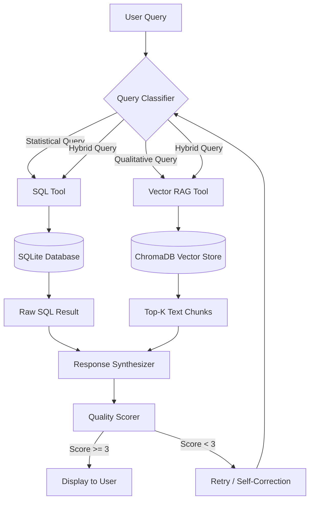

# 🔍 Fraud Analysis Agent

A hybrid AI chatbot that extracts meaningful information from both tabular fraud transaction data and an unstructured PDF document about credit card fraud. Built with PydanticAI, Together AI, SQLite, and ChromaDB.

## Architecture



**Key components:**
- **Query Classifier** — Routes questions to SQL, RAG, or both (uses 70B model for speed)
- **SQL Tool** — Generates and validates SQLite queries via schema-aware few-shot prompting
- **RAG Tool** — Semantic search over PDF chunks stored in ChromaDB
- **Response Synthesizer** — Combines tool outputs into a coherent answer (uses 405B model)
- **Quality Scorer** — Self-evaluates answers on a 1–5 scale with hallucination detection

## Prerequisites

- Python 3.10+
- [Together AI](https://together.ai) API key (free tier available)

## Quick Start

```bash
# 1. Clone and enter the project
git clone <repo-url> && cd mekari-test

# 2. Create virtual environment
python -m venv .venv
# Windows
.venv\Scripts\activate
# macOS/Linux
source .venv/bin/activate

# 3. Install dependencies
pip install -r requirements.txt

# 4. Configure environment
cp .env.example .env
# Edit .env and set your TOGETHER_API_KEY

# 5. Download dataset
# Place fraudTrain.csv and fraudTest.csv from Kaggle Fraud Dataset
# and "Understanding Credit Card Frauds.pdf" into the dataset/ folder

# 6. Initialize data (SQLite + ChromaDB)
python scripts/setup_data.py

# 7. Run the app
streamlit run app.py
```

## Usage

The chatbot handles three types of questions:

| Type | Example | Tool |
|------|---------|------|
| **SQL** | "How does the monthly fraud rate fluctuate?" | SQLite aggregation |
| **RAG** | "What are the primary methods of credit card fraud?" | ChromaDB vector search |
| **Hybrid** | "What share of fraud in H1 2023 was cross-border?" | Both tools |

### Sample Questions

1. *"How does the daily or monthly fraud rate fluctuate over the two-year period?"*
2. *"Which merchants or merchant categories exhibit the highest incidence of fraudulent transactions?"*
3. *"What are the primary methods by which credit card fraud is committed?"*
4. *"What are the core components of an effective fraud detection system, according to the authors?"*
5. *"How much higher are fraud rates when the transaction counterpart is located outside the EEA?"*
6. *"What share of total card fraud value in H1 2023 was due to cross-border transactions?"*

## Configuration

All models are configurable via `.env`:

```env
TOGETHER_API_KEY=your_key
PRIMARY_MODEL=meta-llama/Meta-Llama-3.1-405B-Instruct-Turbo
ROUTING_MODEL=meta-llama/Meta-Llama-3.1-70B-Instruct-Turbo
EMBEDDING_MODEL=BAAI/bge-base-en-v1.5
```

## Project Structure

```
mekari-test/
├── app.py                          # Streamlit entry point
├── core/
│   ├── agent.py                    # Agent orchestrator with retry loop
│   ├── query_classifier.py         # LLM-based query routing
│   ├── response_synthesizer.py     # Response synthesis with citations
│   └── quality_scorer.py           # 1-5 quality scoring + hallucination check
├── tools/
│   ├── sql_tool.py                 # Text-to-SQL with validation pipeline
│   ├── rag_tool.py                 # Document search and retrieval
│   └── document_processor.py       # PDF extraction and chunking
├── models/
│   ├── schemas.py                  # Pydantic models
│   └── enums.py                    # QueryType, ErrorType enums
├── services/
│   ├── together_ai.py              # Together AI client (chat + embeddings)
│   ├── database.py                 # SQLite connection and setup
│   └── vector_store.py             # ChromaDB management
├── components/
│   ├── chat_interface.py           # Streamlit chat UI
│   ├── response_display.py         # Response rendering with charts
│   └── quality_indicator.py        # Quality score badge
├── utils/
│   ├── error_handler.py            # Error handling utilities
│   └── helpers.py                  # Config, sanitization, SQL safety
├── scripts/
│   └── setup_data.py               # Data ingestion script
├── tests/
│   └── test_backend.py             # Component + E2E tests
├── dataset/                        # CSV files + PDF (not committed)
├── requirements.txt
├── .env.example
└── .gitignore
```

## Testing

```bash
# Quick tests (no API calls)
python tests/test_backend.py --quick

# Component tests (SQL tool, RAG tool, classifier, scorer)
python tests/test_backend.py

# Full E2E tests (all 6 sample questions)
python tests/test_backend.py --full
```

## Technical Design

### Text-to-SQL
Schema-aware few-shot prompting with a 5-step validation pipeline: Generate → Parse (EXPLAIN) → Safety check (regex) → Execute (with timeout) → Format.

### RAG Pipeline
PDF → page-by-page extraction → sentence-boundary chunking (500 chars, 100 overlap) → Together AI embeddings → ChromaDB with cosine similarity → top-7 retrieval.

### Quality Scoring
A separate LLM call evaluates each response against source context on a 1–5 rubric. Scores below 3 trigger up to 2 retries. The best-scored response is returned with a disclaimer if quality remains low.

### Error Handling
- SQL safety: read-only enforcement, forbidden keyword regex, EXPLAIN dry-run
- Graceful degradation: if one tool fails, the other still answers with a disclaimer
- API resilience: retry with backoff for rate limits and server errors

## Known Limitations

- The dataset does not contain EEA or cross-border fields, so Q5/Q6 rely primarily on the PDF document
- The embedding model (bge-base-en-v1.5) has a 512-token limit, so chunks are truncated for embedding
- Quality scoring adds latency (~2-3s per response)
- The dataset covers 2019–2020, not H1 2023, so Q6 answers from document context only
